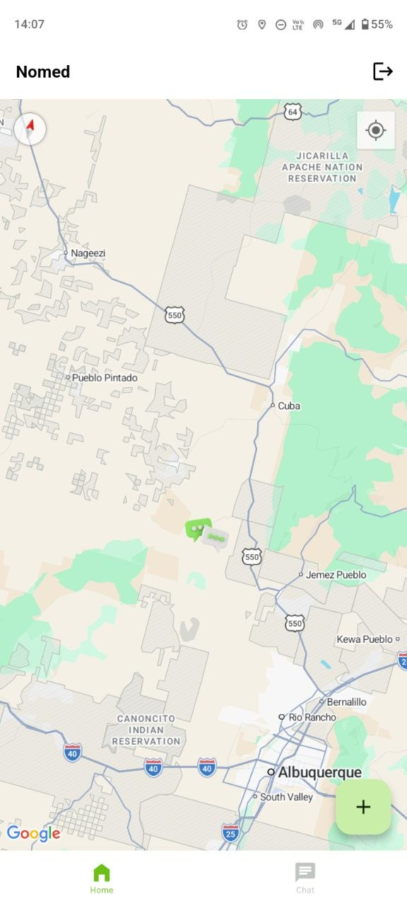
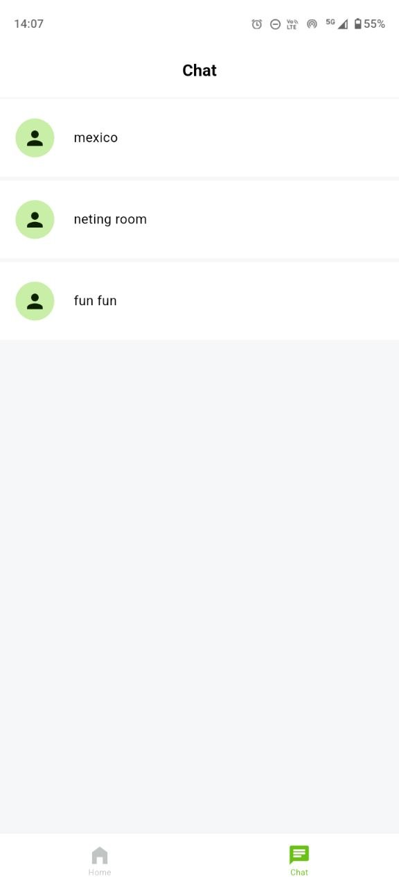
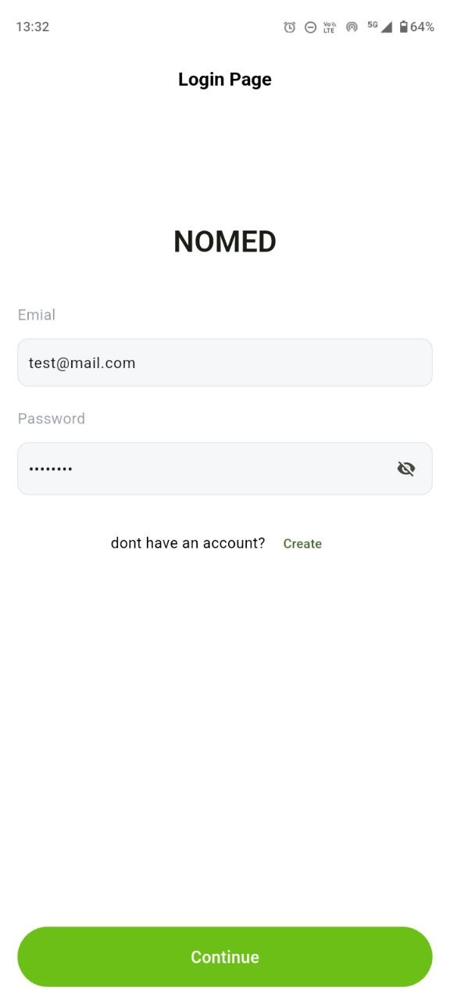

# Nomed - Real-time Location-based Chat App

Nomed is a modern, location-aware full-stack application that allows users to discover, join, and interact in location-specific chat rooms. Find rooms nearby on a Google Map, create your own rooms based on your current location, and chat with others in real-time.


## Features

- **Authentication System**: Secure user registration and login using JWT.
- **Location-Based Discovery**: Interactive Google Map interface showing chat rooms clustered around the user's location.
- **Real-Time Chat**: WebSockets (Socket.io) integration for instantaneous messaging within any room.
- **Room Management**: Create new chat rooms tied to geographical coordinates.
- **State Management**: Robust BLoC pattern for managing UI state across the Flutter app.
- **Clean Architecture**: Separation of concerns between the presentation layer, domain/business logic, and network layer.

## 📱 Download

[⬇️ Download Latest APK](https://github.com/akashpd390/nomed/releases/latest)

## Tech Stack

### Frontend (Flutter)
- **Framework**: Flutter (v3.32)
- **State Management**: Flutter BLoC
- **Networking**: Dio
- **Real-time Engine**: socket_io_client
- **Maps & Location**: google_maps_flutter, geolocator
- **Dependency Injection**: get_it

### Backend (Node.js)
- **Runtime**: Node.js & Express.js (TypeScript)
- **Real-time Server**: Socket.io
- **Database**: MongoDB with Mongoose
- **Security**: bcrypt, jsonwebtoken, zod (for schema validation)

## Getting Started

### Prerequisites
- [Flutter SDK](https://docs.flutter.dev/get-started/install)
- [Node.js](https://nodejs.org/en/download/)
- MongoDB Instance

### Server Setup (Node.js)
1. Navigate to the server directory:
   ```bash
   cd nomed-server
   ```
2. Install dependencies:
   ```bash
   npm install
   ```
3. Create a `.env` file referencing the `.env.example` file and provide your MongoDB URI and JWT secrets.
4. Start the server (Dev Mode):
   ```bash
   npm run dev
   ```

### App Setup (Flutter)
1. Ensure the server is running and accessible (update API baseUrl in `lib/shared/network/` if on a physical device).
2. Install dependencies:
   ```bash
   flutter pub get
   ```
3. Add your Google Maps API Key to `android/app/src/main/AndroidManifest.xml` and `ios/Runner/AppDelegate.swift`.
4. Create a `.env` file in the Flutter root for your API endpoints.
5. Run the app:
   ```bash
   flutter run
   ```

## Project Structure

- `lib/`
  - `features/`: Contains specific feature modules (`auth`, `home`, `chat`).
    - `bloc/`: State management logic.
    - `domain/`: Business logic, network, and socket abstractions.
    - `model/`: Data structures.
    - `ui/`: Screens and widgets.
  - `core/`: Shared constants, helpers, and dependency locator.
  - `shared/`: App-wide API endpoints and setups.

## Screenshots

<div align="center">
  <!-- Replace the src with your actual screenshots -->
  
  &nbsp;&nbsp;&nbsp;&nbsp;
  
  &nbsp;&nbsp;&nbsp;&nbsp;
  
</div>
